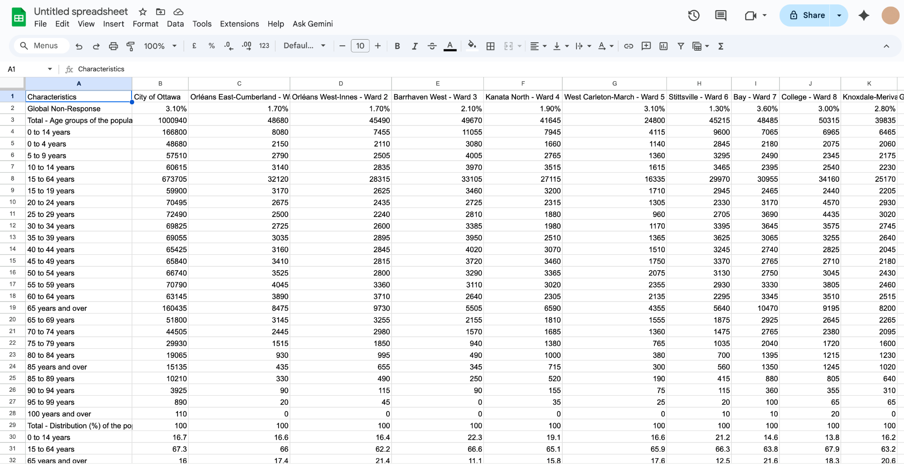
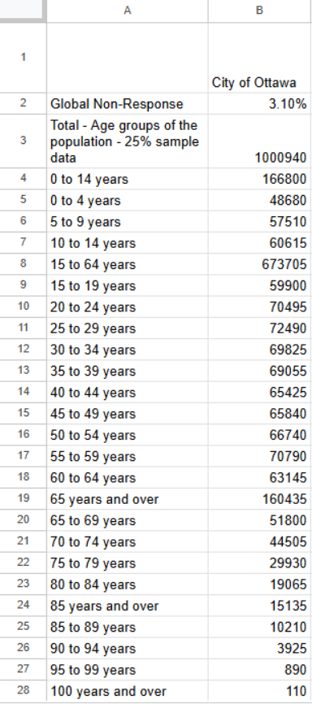
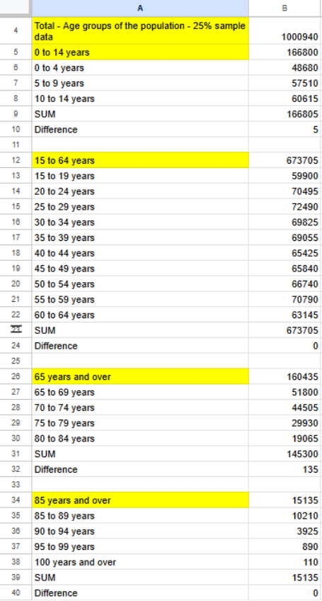
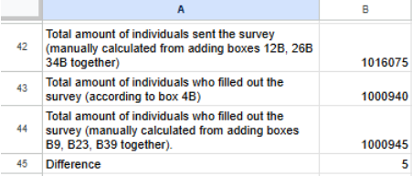

**November 6th, 2025** 
**2003A Introductory Data Storytelling** 
**Michelle Clarke, Yi Liu, Corinna MacIntyre** 
**Presented to Jean-Sébastien Marier** 

# Exploratory Data Analysis (EDA) & Pitch

Use one hashtag symbol (`#`) to create a level 1 heading like this one.

## Foreword

For this assignment, you must extract data from a dataset provided by the instructor. You must then clean and analyze the data, create exploratory charts/visualizations, and find a potential story idea. Your assignment must clearly detail your process. You are expected to write about 1500-2000 words, and to include several screen captures showing the different steps you went through. Your assignment must be written with the Markdown format and submitted on GitHub Classroom.

I have been assigning different versions of this project to my digital journalism and data storytelling students for a few years now. Its structure was inspired by the main sections/chapters of [*The Data Journalism Handbook*](https://datajournalism.com/read/handbook/one/). This version was further inspired by the [Key Capabilities in Data Science](https://extendedlearning.ubc.ca/programs/key-capabilities-data-science) program offered by the University of British Columbia (UBC).

**Here are some useful resources for this assignment:**

* [GitHub's *Basic writing and formatting syntax* page](https://docs.github.com/en/get-started/writing-on-github/getting-started-with-writing-and-formatting-on-github/basic-writing-and-formatting-syntax)
* [The template repository for this assignment in case you delete something by mistake](https://github.com/jsmarier/jou4100_jou4500_mpad2003_project2_template)

Did you notice how to create a hyperlink? In Markdown, we put the clickable text between square brackets and the actual URL between parentheses.

And to create an unordered list, we simply put a star (`*`) before each item.

## 1. Introduction
Group 2 - a group comprised of Li Yu, Michelle Clarke and myself (Corinna MacIntyre) - have been tasked to come up with a Story using Ottawa's Ward Data. The data we are using has been sourced from Government Canada’s 2021 Long Form Census, and is to be analyzed and compiled into a visual story by the end of the semester. In this pitch, we explore the mechanics of how we obtained the dataset, along with the VIMO process and cleaning it up. Finally, we will discuss further steps and where we will take the project. 

## 2. Getting Data
To import the dataset into Google Sheets, I started by opening a new blank sheet in Google Sheets. Then I clicked on File at the top left corner, selected Import, and clicked Upload to import the dataset file from my computer. Once the file was uploaded, I selected to replace the current sheet so all the data would show up.

 
*Figure 1: The "Import file" prompt on Google Sheets.*
https://docs.google.com/spreadsheets/d/1ESC7UYWp0z3m3hqM10Egz4zKhD1YXBQz2nB49yQn69A/edit?usp=sharing

Looking at the dataset, I noticed that it has 26 rows and 2,603 columns. In this dataset, Global Non-Response shows the percentage of people who didn’t answer the survey in each ward, so it’s a continuous variable because it can take on decimals like 1.7% or 7.6%. Total - Age groups of the population gives the total number of people in each ward, which is also a continuous variable since the numbers can vary widely from ward to ward. Looking further at household data, the column In a two-parent family gives a count of children living with both parents in each ward, which is a discrete variable because it’s whole numbers. 

The dataset has 26 rows and 2,603 columns. The data isn’t super clean. Some cells are blank, which might mean the info is missing or there just isn’t any data for that row. Also, a lot of the numbers have commas (like “26,395”), which can mess up trying to find certain data because Google Sheets treats them as text instead of actual numbers. That means you’ll have to spend more time cleaning it up before doing any calculations.

As I look at the raw data, one question that comes to mind is why some language rows have all zeros. I’m not sure if that means the data is missing or if there really aren’t any speakers of those languages in certain wards. A hypothesis I have is that wards with more people aged 65 and over probably have more people living alone, while wards with more kids (0–14 years) probably have more two-parent families.

## 3. Understanding Data
### 3.1. VIMO Analysis 
###### Reliability
This data is from Government Canada’s 2021 Long Form Census. Government Canada is a trusted source, however it is important to note that the data might not fully reflect true numbers. 

The Long Form Census was sent out to 25% of the population across Ottawa, meaning 75% of citizens did not fill it out. It does not mean the data collected is “wrong”, however the actual numbers may differ since it was a sample pool. 

Overall, this is not a huge issue. Statistics Canada states “The long-form sample is evenly distributed geographically to ensure a high degree of reliability of the estimates for all areas of the country,” (2023).

They have also taken the care to make sure that while Wards are different sizes, the amount of people responding in ratio does not change. On the site they continue and state they aim “to grant the same degree of importance to all geographic units of a given size,” (2023).

###### Issues
Unfortunitely, I still think this might lead to a discrepancy for outlier communities and minorities. They still have a smaller percentage providing answers in the census, even if it has been distributed evenly.

Using smaller numbers as an example, imagine there is a community who makes up 2% of a population. 2/100 turns into 0.5/25. This therefore leaves the minority to be represented by only 0.5 people. In this example, it might present inaccurate data about said minorities, perhaps making it seem like a group or even ward has a higher likelihood to have an income of x or y, when only a small cross section of the group had answered. It is something that would prevail despite the effort to make sure the survey has been divided equally across geographical land.

One example of an outlier (and possible error in our data) can be found in sections regarding Indigenous and Aboriginal peoples. 

For example, there is a row labelled “Total - Private households by tenure - 25% sample data.”   

One of the sub categories of this is “Dwelling provided by the local government, First Nation or Indian band”. However, when one looks at the ward data the number is zero for each and every column. 

The columns overall are a little difficult to read, especially when trying to make sure there are no missing numbers. The categories are not broken up, and are laid out in one sprawling wall of boxes. I believe Michelle touches on this in her part as well.

###### Missing and Invalid Data
It is difficult to tell if are many cases of missing numbers until we can easily sort the categories. Here is an example of an issue I ran into.

 
(*Figure 2: section of original dataset seen in Figure 1.*)

The above image is taken from the origninal cvs file after being converted to google docs; specifically columns A-B, rows 1-28. It all looks like it could be a part of the same "total" when checking for missing variables, however it is most certainly not, especially if one tries to add up all the values in column B.

 
(*Figure 3: an annotated copy of the dataset*)
https://docs.google.com/spreadsheets/d/1lHASh3lvd288mOsTj2e4Pb3ZJo5Nit0Mnzyi_P1U1-4/edit?usp=sharing

Here is an annotated and edited version of the dataset. It is comprised of columns a-b, and rows 1-44. The highlighted yellow boxes are new categories, and are the "totals" that can be used for identifying missing or invalid data. 

I added a SUM section which tallied up the individual rows of numbers and then compared them to the overall total listed in the original dataset - this is listed as "difference" in my annotated chart.

 
(*Figure 4, totals up and compares information from Figure 3*)
https://docs.google.com/spreadsheets/d/1lHASh3lvd288mOsTj2e4Pb3ZJo5Nit0Mnzyi_P1U1-4/edit?usp=sharing 

Here is an additonal section I added to the annotated spreadsheet from Figure 3, to compare data totals and accuracy. It seems to be off, even when removing the 3.1% from the Non-Response percentage.

Overall, I cannot fully and thoroughly assess the dataset without cleaning the entire spreadsheet.

### 3.2. Cleaning Data

Insert text here.

### 3.3. Exploratory Data Analysis (EDA)

Insert text here.

**This section should include a screen capture of your pivot table, like so:**

 
*Figure 2: This pivot table shows...*

**This section should also include a screen capture of your exploratory chart, like so:**

 
*Figure 3: This exploratory chart shows...*

## 4. Potential Story

We want to explore how different wards in Ottawa are being funded and developed, and whether some areas are getting left behind. Looking at the numbers, some wards seem to have higher incomes and more people living in houses, while others have lower incomes or more people in apartments. Are those differences reflected in how much funding or resources each ward gets? And if not, why might certain areas be overlooked?

To tell this story properly, we would need more detailed data, including ward budgets, per-person investment, and housing types by ward. It would also help to have visuals like maps we could overlay with income, population, ward type (rural, suburban, or urban), and funding levels. Seeing these patterns on a visual map would make it much easier to spot imbalances and understand how resources are distributed across the city.

The story could start with a city-wide map highlighting income differences across wards, immediately showing readers where gaps may exist. From there, it could zoom in on one or two different wards, perhaps a wealthy, well-resourced area versus a lower-income ward with fewer resources to highlight the human impact of these imbalances. Adding stories from local residents, along with visual data, could really show not just where the differences exist, but why they matter and how they affect these communities.

## 5. Conclusion

In conclusion, the team will be moving forward to research ward data. We will analyse if there are any discrepancies in funding and quality of life overall from ward to ward - along with what might be contributing to the data reflecting as such. The dataset itself will also be re-assesed when it's been re-categorized/organized. Lastly, the group will continue to search for other information and statistics/data to help support our story.

## 6. References

Government of Canada. (2023, September 22). *Sampling and weighting technical report, census of Population, 2021 1. census data collection. 1. Census data collection.* Statistics Canada
https://www12.statcan.gc.ca/census-recensement/2021/ref/98-306/2021001/chap1-eng.cfm 

